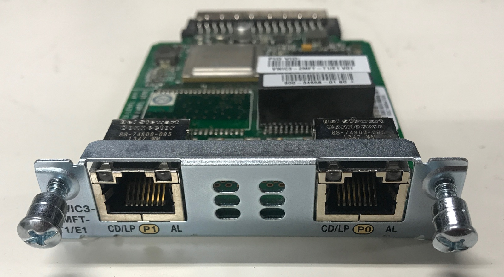
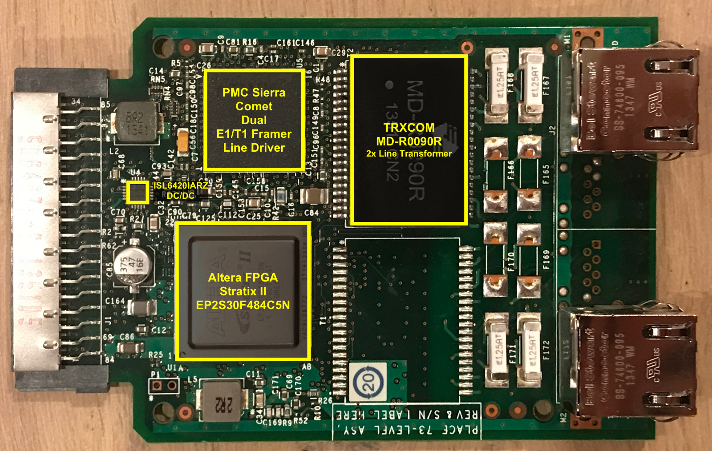
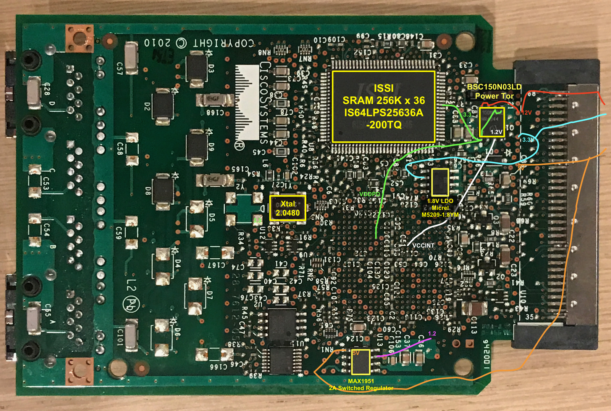
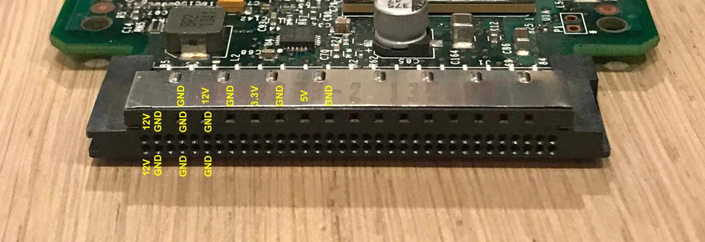
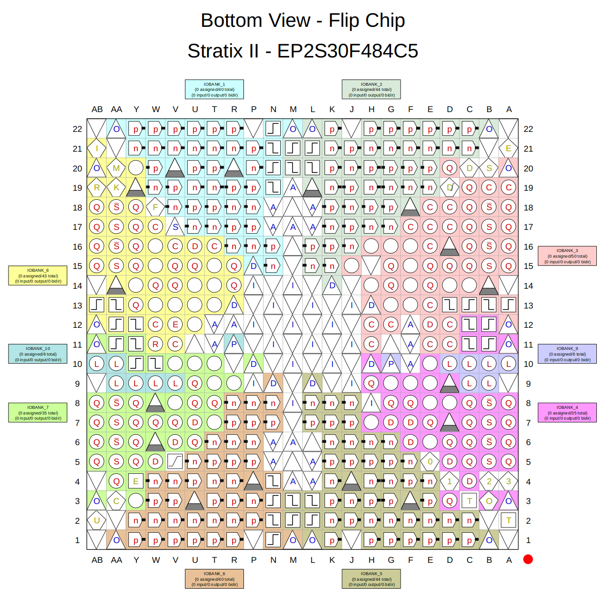
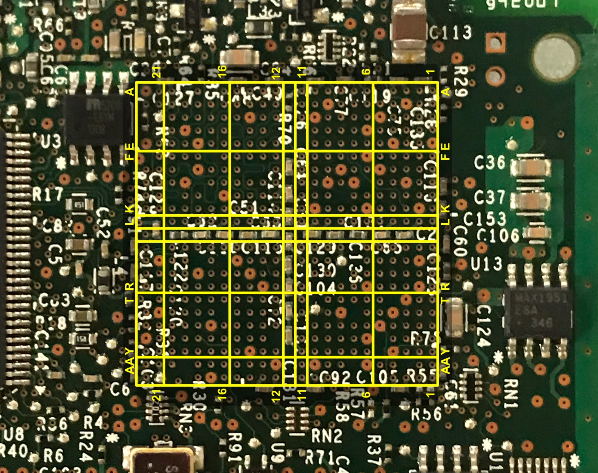

# CISCO VWIC2-2MFT-T1/E1 WAN Card Reverse Engineering

The goal of this project was to reverse engineer the Cisco VWIC2-2MFT-T1/E1 WAN card. These are
plug-in board that slide into a standard HWIC slot of a Cisco routers.

These boards can be found for $5 on eBay and when properly reverse engineered, they'd be perfect
board for hobby FPGA applications.



Except for one thing: while Intel lists that Stratix-II FPGA are supported with the Quartus Web Edition
11.0sp1, this is only true for the EP2S15 FPGA, **not the EP2S30 FPGA**! For that one, you need the
expensive Quartus Standard Edition.

And that makes reverse engineering this board pretty much useless... I obviously only figured this
out after already spending a healthy number of ours of working on the reverse engineering the board.

For posterity's sake, here's the information that I was able to tease out of the PCB.

## FPGA Board Hack

I found out about this board through the [FPGA Board Hack](https://hackaday.io/project/159853-fpga-board-hack)
project.

It lists a number of commercial projects that have an FPGA in them, and it has a decicated log
about [Cisco VWIC3-2MFT](https://hackaday.io/project/159853-fpga-board-hack/log/161719-stratix-ii-cisco-vwic3-2mft),
but no real practical information about how to wire things up, or which IOs can be used.

## PCB Components


PCB Top:



PCB Bottom:



Main Active Components:

* Altera Stratix II EP2S30F484C5N FPGA

* ISSI IS64LPS25636A 256K x 36 200MHz SRAM

    * [Datasheet](https://datasheet.octopart.com/IS61VPS25636A-200TQLI-ISSI-datasheet-8372950.pdf)

* PMC Sierra Comet Dual T1/E1 Framer/Line Driver

* 2.0480 MHz Xtal

Power Regulators:

* ISL6420AIRZ Buck PWM Controller

* BSC150N03LD Dual MOSFET Power Transistor

    Controller by ISL

    Input Ext 12V -> 3.3V (SRAM VDD etc.) -> 1.2V (FPGA VCCINT)

* Micrel M5209-1.8YM 1.8V LDO

    Input Ext 3.3V -> 1.8V (FPGA VDDPD)

* MAX1951 Switched Regulator 

    Input Ext 5V -> ?

Extra stuff:

* TRXCOM MD-R0090R Dual Line Transformer

* CV9606

    Texas Instruments custom part for Cisco?

## Cisco HWIC Connector

The CISCO HWIC connector has 2 rows with pins that are 1.26mm spaced, and 1 row with pins that are 2.56mm spaced. 

AFAIK, this top row is only used for power delivery: 12V, 5V, and 3.3V.

There are CISCO board that only have the bottom 2 rows. From what I've measured, the bottom 2 rows only contain a 12V
supply, no 5V or 3.3V pins.



## Power

In theory, you need 3 external power supplies to feed this thing: 12V, 5V, and 3.3V.

However, you can get away with only 5V by doing this:

* Connect the 12V to 5V.

    The 12V goes into a power regulator that creates 3.3V. When you dial down the voltage on your external
    power supply from 12V to 5V, the regulator still outputs 3.3V.

* Connect the 3.3V that comes out of the 3.3V regulator to the external 3.3V input

    It's unclear why there is an external 3.3V and an internally generated 3.3V. 
    But everything seem to work by tying them together (as far as I could tell.)

## FPGA pinout





## FPGA Pin Assigment

N20: Xtal 2.0480 MHz


HWIC FPGA Connections (copied from FPGA Board Hacks):

```
GND	69	1			35
		2	GND	GND	36
	70	3	K1	GND	37
		4		F5	38
	71	5		GND	39
		6	GND		40
	72	7			41
		8			42
	73	9			43
		10	GND	GND	44
	74	11		K4	45
		12		K6	46
	75	13	K7	K8	47
		14	J7	J8	48
	76	15	K2	C5	49
		16	C4	F1	50
	77	17		GND	51
		18	H3	H4	52
	78	19	H5	H6	53
		20	H7	G5	54
	79	21	G6	G7	55
		22			56
5.0	80	23			57
		24	GND		58
GND	81	25			59
		26	F4	F2	60
3.3	82	27	E1	F7	61
		28	F6		62
GND	83	29	GND	F8	63
		30	E3	GND	64
12.	84	31	GND	B13	65
		32	B11	GND	66
GND	85	33	GND	W11	67
		34			68
```

SRAM FPGA Connections (copied from FPGA Board Hacks):
```
1	219	H12	DQPc
2	1614	E20	DQc0
3	1572	F21	DQc1
4	-		VDDQ
5	-		VSSQ
6	1599	F19	DQc2
7	1602	F20	DQc3
8	231	G12	DQc4
9	195	G13	DQc5
10	-		VSSQ
11			VDDQ
12	114	G14	DQc6
13	75	G15	DQc7
14	-		N.C.
15	-		VDD
16	-		N.C.
17	-		VSS
18	42	G16	DQd0
19	207	F13	DQd1
20	-		VDDQ
21	-		VSSQ
22	120	F14	DQd2
23	87	F15	DQd3
24	57	F16	DQd4
25	1575	G17	DQd5
26	-		VSSQ
27	-		VDDQ
28	1578	G18	DQd6
29	1587	G19	DQd7
30	159	H14	DQPd
31	-		LBOn
32	21	B19	A5
33	180	A15	A4
34	168	A16	A3
35	144	A17	A2
36	150	A18	A1
37	24	A19	A0
38	-		N.C.
39	-		N.C.
40	-		VSS
41	-		VDD
42	1605	D22	N.C.(A18)
43	213	C14	A17
44	1617	C22	A10
45	1608	C21	A11
46	72	C19	A12
47	132	C18	A13
48	147	C17	A14
49	183	C16	A15
50	186	C15	A16
51	375	H9	DQPa
52	288	A8	DQa0
53	300	A7	DQa1
54	-		VDDQ
55	-		VSSQ
56	297	B8	DQa2
57	309	B7	DQa3
58	345	B5	DQa4
59	324	A6	DQa5
60	-		VSSQ
61	-		VDDQ
62	336	A5	DQa6
63	333	B6	DQa7
64	-		ZZ
65	-		VDD
66	-		N.C.
67	-		VSS
68	105	D15	DQb0
69	117	E14	DQb1
70	-		VDDQ
71	-		VSSQ
72	96	E15	DQb2
73	30	E16	DQb3
74	27	E17	DQb4
75	33	D17	DQb5
76	-		VSSQ
77	-		VDDQ
78	12	D18	DQb6
79	1611	E19	DQb7
80	234	H11	DQPb
81	189	B15	A9
82	177	B16	A8
83	-		ADVn
84	-		ADSPn
85	1563	H17	ADSCn
86	1560	H19	OEn
87	1566	H18	BWn
88	-		GW
89	267	C10	CLK
90	-		VSS
91	-		VDD
92	-		CS2n
93	1593	E22	WEan
94	1581	F22	WEbn
95	1557	G22	WEcn
96	1545	H22	WEdn
97	-		CS2p
98	1584	E21	CS1n
99	153	B17	A7
100	141	B18	A6
```
